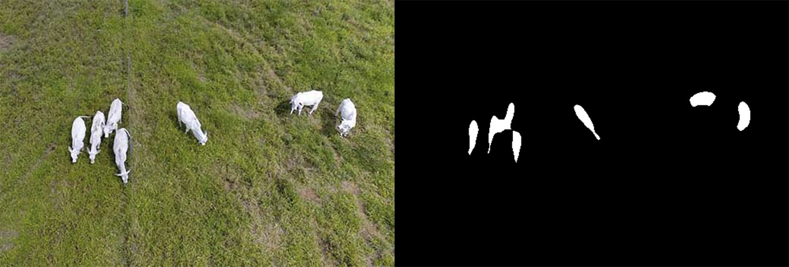
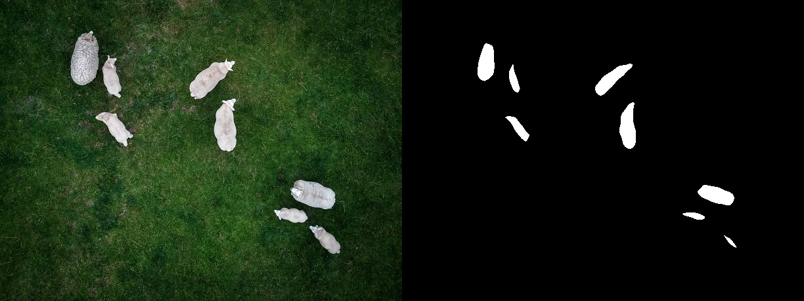
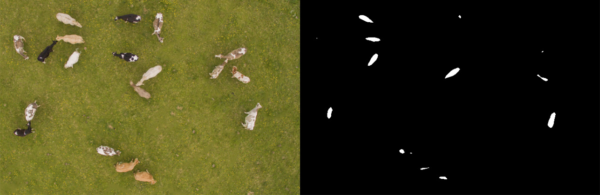

# 🐮 Processamento digital de imagens aplicado para contagem de gado

Projeto realizado utilizando as tecnologias: Java, OpenCv e JavaFX.

Esse projeto foi criado se baseando completamente no seguinte artigo: [Aplicação de algoritmos de Visão Computacional na contagem de gado por meio de processamento de imagens aéreas](https://revistas.setrem.com.br/index.php/reabtic/article/view/343)

## 🛠 TÉCNICAS UTILIZADAS

### 1. **Escala de cinza**:

A utilização da escala de cinza tem como principal motivo o refinamento da imagem, assim removendo detalhes desnecessários, além de preparar a imagem para o processo de limiarização. Dessa forma resultando em uma imagem binária e facilitando a contagem de objetos.

### 2. **Suavização**:

Assim como o filtro da escala de cinza, a suavização também tem como objetivo a remoção de ruídos, assim tendo um resultado melhor durante a apliocação da limiariazação. Nesse caso foi utilizado o filtro Gaussiano que se baseia na distribuição estatística dos valores que se agrupam em torno da média conhecida como distribuição Gaussiana. Possui um efeito visual que gera um desfoque na imagem. 

### 3. **Limiarização**

Serve para isolar os itens e binarizar a imagem, fazendo com que seja possível realizar a contagem de objetos na com uma maior facilidade.

### 4. **Transformações morfológicas**:

É usada com o objetivo de fazer uma limpeza na imagem após a aplicação da limiarização. Nesse caso é aplicado a erosão para remover a maior quantidade possível de ruídos.

### 5. **Contador de bordas**:

Após aplicação dos operadores morfológicos, o resultado foi uma imagem binária que possui grupos de objetos binários denominados Blobs. Esse algoritmo faz a contagem desses grupos.

## 📈 RESULTADOS OBTIDOS

Na maioria dos casos vemos resultados ok, porém quando existe uma variação de cores de animais ou animais com cores mais próximas à do terreno, acontece uma contagem imprecisa dos animais, porque eles acabam sendo eliminados durante a aplicação dos filtros.

Nas imagens abaixo podemos ver o resultado obtido após a aplicação dos filtros e a contagem realizada.

### Teste 01:

- Quantidade de animais: 7
- Contagem realizada: 6
- Assertividade: 85.7%

### Teste 02:

- Quantidade de animais: 8
- Contagem realizada: 8
- Assertividade: 100%

### Teste 03:

- Quantidade de animais: 19
- Contagem realizada: 14
- Assertividade: 73.6%

## Conclusão

- Simulação obteve resultados semelhantes ao do artigo.
- Resultados bons, porém imprecisos quando existe variação de tonalidade dos animais ou aglomeração dos mesmos.
- Possível melhoria através da utilização de imagens térmicas.
